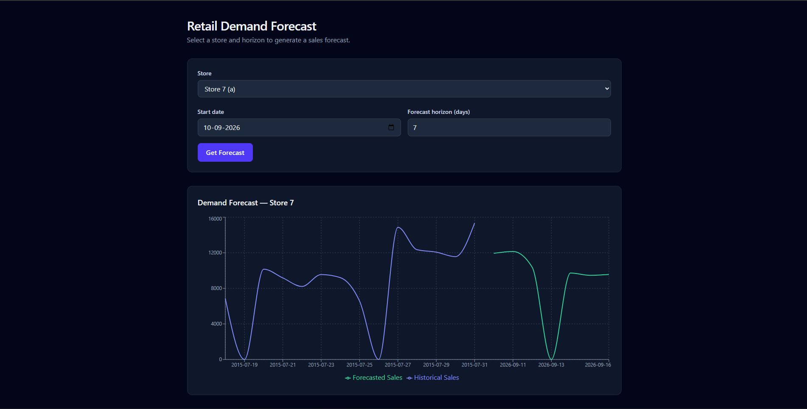

# Retail Demand Forecasting Platform

A full-stack machine learning application that forecasts daily store-level retail sales, built end-to-end over one week — from raw data to a deployed, interactive web app.

**Live demo:** https://retail-demand-forecasting-platform-1.onrender.com
**Backend API docs:** https://retail-demand-forecasting-platform-3qpx.onrender.com/docs

> Note: both services run on Render's free tier and may take 30–60 seconds to wake up on first request after inactivity.

---

## Overview

Retailers need to forecast demand to make inventory decisions — order too little and you risk stockouts, order too much and you tie up capital in unsold stock. This project builds a demand forecasting tool that predicts daily unit sales for a given store, up to several days in advance, using historical sales patterns, promotions, and calendar effects.

A user selects a store and a forecast horizon, and the app returns a day-by-day sales forecast alongside recent historical sales, visualized as a chart.

---

## Screenshots


*Store selection, forecast horizon input, and historical vs. forecasted demand chart.*

---

## Architecture

```
React (Vite, Tailwind, Recharts)
        │
        ▼
FastAPI backend (Dockerized)
        │
        ├── Pydantic request/response validation
        ├── Recursive multi-day prediction pipeline
        ▼
Random Forest model (scikit-learn, saved via joblib)
        │
        ▼
Historical sales data (Rossmann dataset)
```

- **Frontend:** deployed as a static site on Render
- **Backend:** containerized with Docker, deployed as a web service on Render
- **Model artifacts & raw data:** versioned with Git LFS (model file and training CSVs exceed GitHub's standard size limits)

---

## Tech Stack

| Layer | Tools |
|---|---|
| ML / Data | Python, pandas, scikit-learn, Jupyter |
| Environment | `uv` for dependency and project management |
| API | FastAPI, Pydantic, Docker |
| Frontend | React (Vite), Tailwind CSS, Recharts |
| Deployment | Render (Docker web service + static site) |
| Versioning | Git, Git LFS |

---

## ML Methodology

### Dataset
[Rossmann Store Sales](https://www.kaggle.com/c/rossmann-store-sales) — daily sales for 1,115 stores over ~2.5 years (Jan 2013–Jul 2015), including store metadata, promotions, and holiday flags.

### Prediction target
Given a store and a calendar date, predict daily unit sales for that store on that date — using only information that would genuinely be available at prediction time (excluding same-day features like `Customers`, which is not knowable in advance and would constitute data leakage).

### Train / validation / test split
A **time-based split** was used rather than a random shuffle: train on data through May 2015, validate on June 2015, test on July 2015. Shuffling would let the model "see the future" relative to what it's evaluated on, which doesn't reflect how the model will actually be used in production (forecasting forward from the present).

### Feature engineering
- **Lag and rolling features** (`sales_lag_1`, 2-day and 7-day rolling averages), computed per-store and strictly using only prior days — verified to correctly reach across train/val/test boundaries without leaking future information.
- **Calendar features:** day of week, month.
- **Holiday features:** state and school holiday flags, one-hot encoded (fit only on the training set).
- **Promotion status**, treated as a required, explicit input rather than inferred — a retailer planning a forecast would know their own promo calendar in advance.

### Baseline vs. model
A naive baseline (each store's historical average sales for that day of week) achieved an MAE of **~1,425** on open-store days. A constrained Random Forest (`max_depth=15`, `min_samples_leaf=5`) reduced this to an MAE of **~838** — a **~41% improvement**. The unconstrained default Random Forest scored marginally better (~807 MAE) but produced a 150+MB model that failed to reliably serialize and load; the depth constraint was a deliberate trade-off favoring a smaller, more robust, deployable model over a marginal accuracy gain.

### Multi-day forecasting
Predictions beyond one day use a **recursive strategy**: each day's prediction is fed back in as input history for the next day's forecast. This means forecast accuracy degrades as the horizon lengthens, since later predictions depend on earlier predictions rather than real observed data — a known, explicit trade-off documented rather than hidden.

---

## Known Limitations

- **Store open/closed assumption:** the frontend currently assumes every store is closed on Sundays and open all other days. This is a reasonable approximation based on patterns observed in the training data, but doesn't reflect each store's actual, individual schedule or one-off closures.
- **No promotion schedule input in the UI yet:** the API supports a day-by-day promo schedule, but the frontend currently always submits "no promotions." Promo status is one of the model's most influential features, so this is a meaningful simplification.
- **Valid forecasting range:** the model was trained on data from 2013–2015. Forecasts starting far beyond that range (e.g., a present-day date) will still run, but extrapolate through a large unmodeled gap and should not be trusted.
- **Store-level granularity only:** the dataset has no product-level detail, so forecasts are per-store, not per-product.
- **Holiday defaults:** if not explicitly provided, state and school holiday flags default to "no holiday" for future dates, since there's no live holiday calendar integration.

---

## Running Locally

### Backend
```bash
uv sync
uv run uvicorn api.app.main:app --reload
```
API available at `http://127.0.0.1:8000`, interactive docs at `/docs`.

### Frontend
```bash
cd frontend
npm install
npm run dev
```
App available at `http://localhost:5173`.

Create a `frontend/.env` file:
```
VITE_API_BASE_URL=http://127.0.0.1:8000
```

### Backend via Docker (optional)
To run the backend exactly as it runs in production:
```bash
docker build -t retail-forecast-api .
docker run -p 8000:8000 retail-forecast-api
```
API available at `http://127.0.0.1:8000` (note: use `127.0.0.1`, not `0.0.0.0`, in your browser — the container binds to `0.0.0.0` internally so it's reachable from outside the container, but that address isn't valid to browse to directly).

---

## Deployment

- **Backend:** Dockerized FastAPI app, deployed as a Render web service. Model artifacts and raw data CSVs are tracked via Git LFS so they're available in the build context.
- **Frontend:** built with `npm run build` and deployed as a Render static site, with `VITE_API_BASE_URL` set via Render's environment variables to point at the live backend.
- **CORS:** the backend explicitly allowlists the deployed frontend's origin.

A real production constraint was hit and resolved during deployment: the backend initially exceeded Render's 512MB memory limit on the free tier, caused by loading the full training CSV (all columns, default dtypes) into memory at startup. This was fixed by loading only the columns actually used by the prediction pipeline (`Store`, `Date`, `Sales`) with explicit, smaller dtypes — reducing memory footprint without changing any model behavior.

---

## What I'd Improve With More Time

- Replace the recursive forecasting strategy with a direct multi-horizon approach (separate models per forecast day) to avoid compounding error
- Infer each store's actual open/closed pattern from its own history, rather than assuming a fixed Sunday closure
- Add a promo/holiday schedule picker in the frontend UI
- Add CI/CD (GitHub Actions: test on push, build on merge)
- Expand automated test coverage beyond the current basic health/predict/invalid-input tests
- Consider MLflow for experiment tracking if the model iterates further